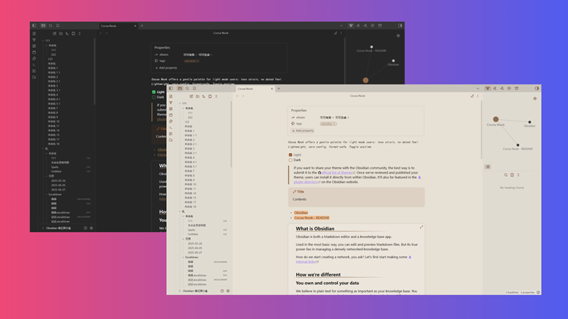
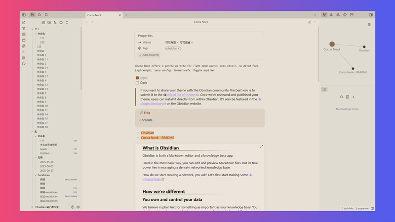

# Cocoa Nook for Obsidian

> A warm-toned eye-care theme, adding a piece of milk chocolate to the cocoa cake — focus in a silky knowledge nook.

Cocoa Nook brings an eye-friendly color scheme for light mode lovers, reducing visual fatigue while trying to avoid an outdated look. The theme introduces only light modifications, requires no setup, does not break note formatting, and can be enabled or disabled at any time.

If you want to use it in Dark mode, it is recommended to set Accent color to `#7D6043`.

